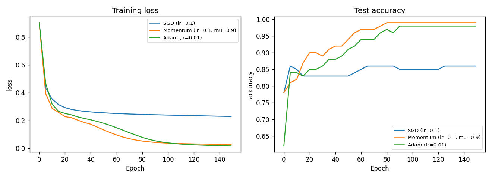
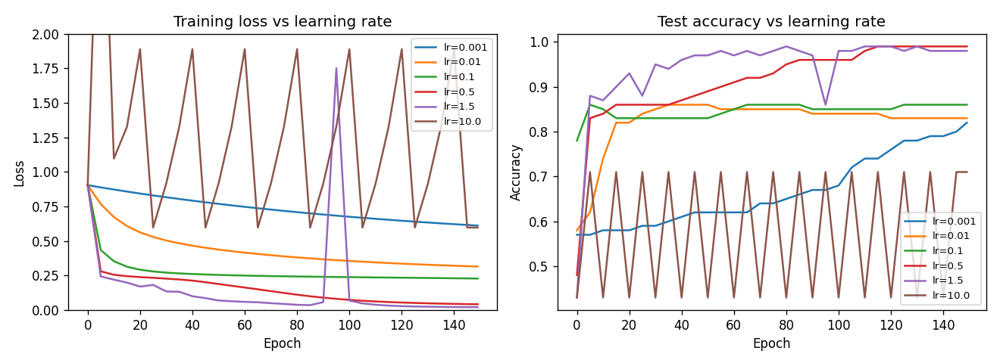
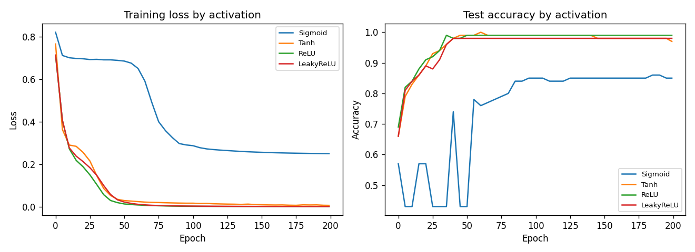
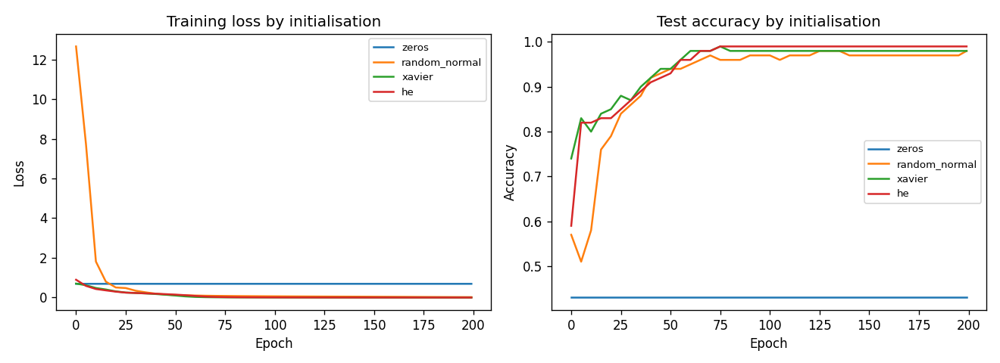
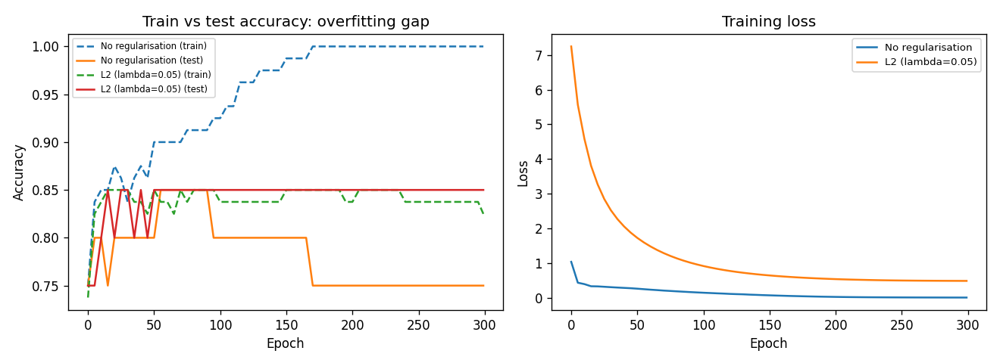
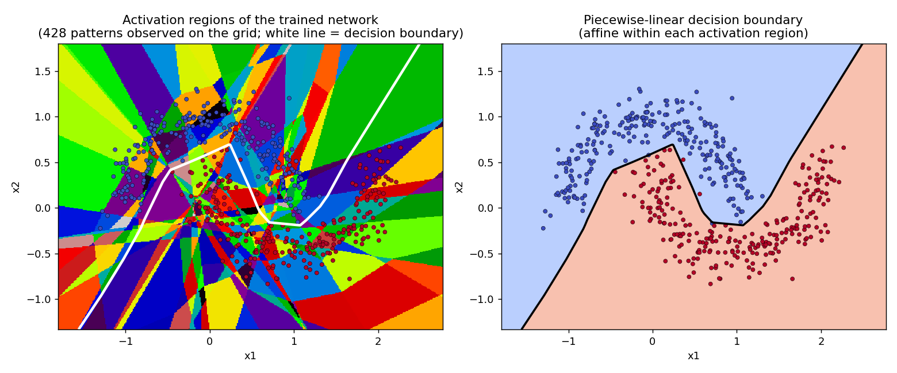

# Neural Networks from First Principles: Matrix Calculus, Optimisation and Piecewise-Linear Geometry

A feedforward neural network implemented entirely in NumPy. No PyTorch,
TensorFlow or automatic differentiation is used in the core implementation.
Every gradient is derived by hand and verified numerically using finite
differences (see `src/gradient_check.py`).

Most "neural network from scratch" projects stop once the model trains.
This project also looks at the geometry of ReLU networks. A trained ReLU
network is a continuous piecewise-linear function, so every input belongs
to a particular linear region determined by its ReLU activation pattern.
The goal is to identify and visualise these regions directly, connecting
the implementation to the result of Zhang et al. (2018) that ReLU
networks compute tropical rational maps. See
`docs/backprop_derivation.md` (Section 7) and
`experiments/piecewise_linear_regions.py`.

## What's implemented

- **Layers:** Dense (fully connected)
- **Activations:** Sigmoid, Tanh, ReLU, LeakyReLU, Linear and Softmax
  (including the full Jacobian-vector product, not just the combined
  softmax cross-entropy shortcut)
- **Losses:** MSE, Softmax + Cross-Entropy (combined gradient)
- **Optimisers:** SGD, Momentum, Adam, all implemented from scratch
- **Initialisers:** Zeros, random normal, Xavier/Glorot and He
- **Regularisation:** L2 weight penalty and an implementation of inverted Dropout.
- **Gradient checking:** analytical gradients verified against centred
  finite-difference estimates, typically to relative errors of 1e-7 or
  better

## Gradient checking

Deriving a gradient on paper and implementing it in code are two
different things. The only way to know the implementation is actually
correct is to check it against an independent method. Every trainable 
parameter gradient computed by backpropagation is verified against a 
numerical estimate from finite differences:

```
dL/dw ≈ [L(w + ε) − L(w − ε)] / (2ε)
```

This doesn't rely on the chain rule or any derived formula, it
directly perturbs each parameter and measures the resulting change in
loss, so it's a genuinely independent check. Run it yourself:

```bash
python src/gradient_check_demo.py
```

Example output, checking every parameter across a 3-layer network with
mixed ReLU/Sigmoid activations and L2 regularisation active:

```
Layer  Param  #checked  Max rel err    Mean rel err   Status
-----------------------------------------------------------------
0      W      30        1.64e-07       8.66e-09       PASS
0      b      6         4.72e-09       1.47e-09       PASS
1      W      24        8.78e-10       2.99e-10       PASS
1      b      4         4.63e-10       2.23e-10       PASS
2      W      12        1.10e-10       2.75e-11       PASS
2      b      3         1.10e-11       4.71e-12       PASS
-----------------------------------------------------------------
ALL CHECKS PASSED
```

This also caught a real bug during development: an early version of
`MSELoss.backward()` divided by batch size alone instead of the total
number of elements, giving a gradient too large by a factor equal to
the number of output dimensions for multi-output regression. Gradient
checking flagged it immediately (67% relative error) before it could
silently affect any experiment.

## Quick start

```bash
pip install -r requirements.txt
cd src
python smoke_test.py
```

This trains a small MLP on a two-moons dataset and prints training/test
accuracy per epoch, reaching approximately 98% test accuracy in 200 epochs.

## Experiments

Each experiment isolates one variable, holding architecture and data
fixed as far as practical. See `docs/backprop_derivation.md` Section 9
for a careful discussion of exactly what each result does and doesn't
prove. All are runnable directly:

```bash
python experiments/optimizer_comparison.py
python experiments/learning_rate_sweep.py
python experiments/activation_comparison.py
python experiments/init_comparison.py
python experiments/regularisation_comparison.py
python experiments/piecewise_linear_regions.py
```

### Optimiser comparison

SGD vs. Momentum vs. Adam, each at a practical learning rate for that
optimiser. Under these learning-rate configurations, Momentum and Adam
converge faster and reach higher test accuracy than plain SGD.



### Learning rate sweep

A cleaner single-variable comparison. Too small converges slowly; too
large (10.0) produces unstable oscillation; there's a well-behaved
range in between.



### Activation comparison

A 5-hidden-layer network, each activation paired with its standard
compatible initialisation (Xavier for sigmoid/tanh, He for ReLU
variants). Sigmoid trains markedly more slowly due to vanishing
gradients; ReLU and LeakyReLU converge cleanly.



### Initialisation comparison

Zero initialisation fails outright. Every unit in a layer stays
identical forever, a pure symmetry problem, not a scaling one.
`random_normal` does eventually converge (~98%), just more slowly and
from a far worse-scaled starting point than Xavier or He.



### Regularisation

An intentionally oversized network on a small, noisy dataset overfits
without regularisation (train accuracy reaches 1.0 while test accuracy
lags, a 25-point generalisation gap). L2 regularisation closes that
gap almost entirely.



### Linear regions of a trained ReLU network

A ReLU network is exactly piecewise linear. This experiment identifies
each point's activation pattern across all ReLU units and visualises
the resulting tiling of input space, 428 distinct regions on this
particular sampled grid. The decision boundary is piecewise linear
too, but its pieces run through region interiors, bending only where
they cross into a new region.



## Repository structure

```
src/
  layers.py               Dense, Dropout
  activations.py          Sigmoid, Tanh, ReLU, LeakyReLU, Linear, Softmax
  losses.py                MSE, SoftmaxCrossEntropy
  optimizers.py            SGD, Momentum, Adam
  initializers.py          zeros, random_normal, xavier, he
  network.py               MLP class composing layers
  gradient_check.py        finite-difference gradient verification
  gradient_check_demo.py   runnable gradient check on a full network
  datasets.py              two-moons generator, train/test split
  train_utils.py           shared training loop
  smoke_test.py            end-to-end sanity check
experiments/               one script per experiment, saves a figure
results/figures/           generated plots
docs/
  backprop_derivation.md   full mathematical write-up
```

## Mathematical background

See [`docs/backprop_derivation.md`](docs/backprop_derivation.md) for:

1. The Dense layer backward pass (dL/dW, dL/db, dL/dX)
2. Activation function derivatives and the vanishing gradient problem
3. The combined softmax + cross-entropy gradient
4. Why Xavier/He initialisation choose the variances they do
5. The L2 regularisation gradient
6. The piecewise-linear structure of ReLU networks and its connection
   to tropical geometry
7. The mathematics of gradient checking
8. A careful, hedged discussion of what each experiment does and
   doesn't demonstrate

## Notes and limitations

- Datasets are small and synthetic (two-moons) by design. The goal is
  to isolate and visualise specific effects clearly, not to benchmark
  against real-world datasets.
- The region count in the piecewise-linear experiment (428) is what's
  observed on a finite sampled grid, not a proven total; see
  `docs/backprop_derivation.md` Section 9.
- The tropical geometry connection is discussed at the level of the
  linear-region structure it implies; it does not yet extract an
  explicit tropical polynomial representation of a trained network.
  That's a natural extension.
